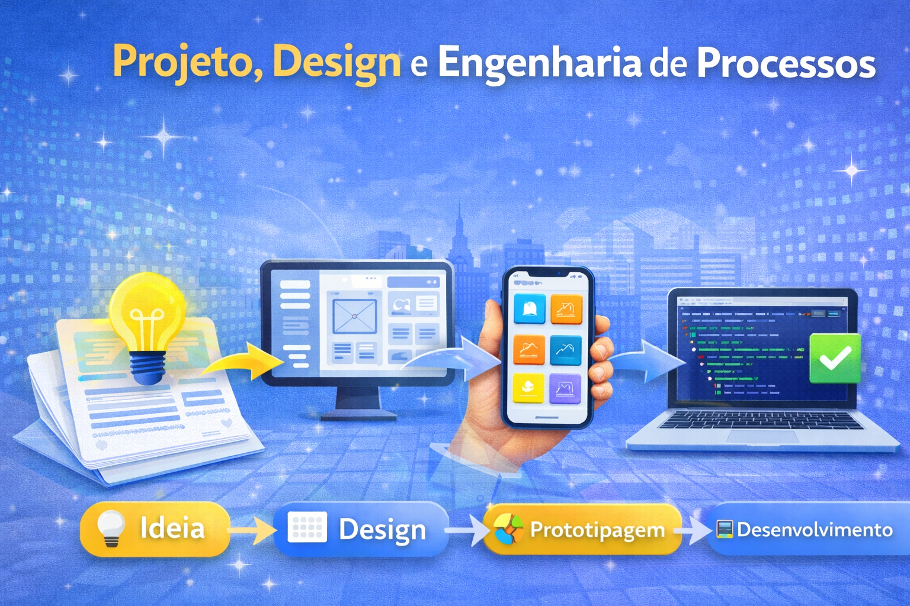

# Projeto e Desenvolvimento de Aplicativos

<figure><figcaption></figcaption></figure>

**Salve galera, sejam bem-vindos à disciplina de Projeto, Design e Engenharia de Processos!**

Nesta disciplina, exploraremos todos os aspectos do desenvolvimento de um projeto de software, abrangendo desde a concepção inicial da ideia até a implementação completa de um aplicativo. Vocês aprenderão a:

* **Conceber Ideias:** Transformar conceitos abstratos em propostas concretas de projetos.
* **Levantamento de Requisitos:** Identificar e documentar as necessidades e expectativas dos usuários e stakeholders.
* **Design:** Criar e refinar a arquitetura e o design do aplicativo, garantindo uma interface amigável e funcional.
* **Prototipagem:** Desenvolver protótipos interativos que possibilitem a validação de conceitos e a obtenção de feedback antes da fase de desenvolvimento.
* **Desenvolvimento:** Implementar o aplicativo seguindo boas práticas de programação e engenharia de software, utilizando ferramentas e tecnologias modernas.

Ao final do semestre, vocês estarão capacitados a conduzir um projeto de software de maneira estruturada e eficiente, desde a ideia inicial até a entrega do produto final. Preparem-se para uma jornada intensa e enriquecedora no mundo da engenharia de software!
