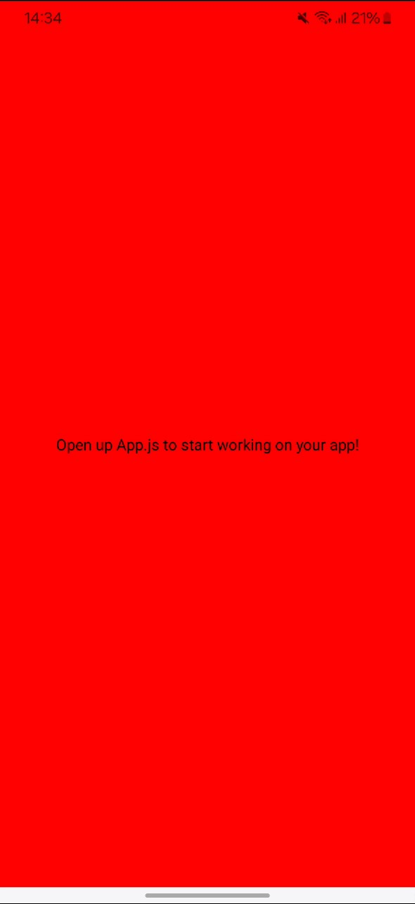
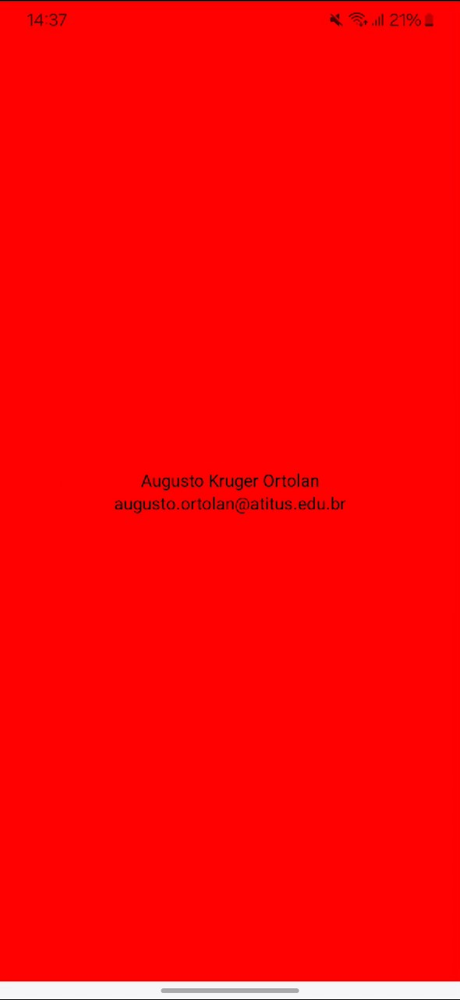

# Vamos para a prática?

<figure><figcaption></figcaption></figure>

Bom, com o nosso ambiente configurado e entendido como criamos um projeto, podemos começar de fato a programar nossos apps.

Para isso, é sempre aconselhável entendermos bem as as funcionalidades dos frameworks que estamos usando. Então, podemos usar a documentação oficial do React Native e do Expo:





### Explicando o código

Quando criamos um novo aplicativo, ao executarmos o mesmo, somos levados a uma tela com a seguinte mensagem “Open up App.js to start working on your app!”. Isso indica que para começarmos o desenvolvimento. É necessário então abrir o código presente no arquivo App.js e começar o trabalho. Abaixo uma imagem do código presente no arquivo:

```jsx
import { StatusBar } from 'expo-status-bar';
import { StyleSheet, Text, View } from 'react-native';

export default function App() {
  return (
    <View style={styles.container}>
      <Text>Open up App.js to start working on your app!</Text>
      <StatusBar style="auto" />
    </View>
  );
}

const styles = StyleSheet.create({
  container: {
    flex: 1,
    backgroundColor: '#fff',
    alignItems: 'center',
    justifyContent: 'center',
  },
});
```

Nas linhas 1 e 2, são realizadas as importações das bibliotecas necessárias, tanto do React como do React Native.

```javascript
import { StatusBar } from 'expo-status-bar';
import { StyleSheet, Text, View } from 'react-native';
```

Entre as linhas 4 e 10 é apresentado um código padrão de uma função exportada que retorna JSX. JSX é uma extensão de sintaxe para JavaScript. Recomendamos usar JSX com o React para descrever como a UI deveria parecer. JSX pode lembrar uma linguagem de template, mas que vem com todo o poder do JavaScript. JSX produz “elementos” do React.

O componente `View` é como uma "caixa" ou "contêiner" que pode conter outros elementos. Ele é usado para agrupar e organizar outros componentes.

O componente `Text` é usado para exibir texto na tela.

O componente `StatusBar` controla a barra de status na parte superior do dispositivo (onde aparecem informações como a hora, bateria, etc.).

```jsx
export default function App() {
  return (
    <View style={styles.container}>
      <Text>Open up App.js to start working on your app!</Text>
      <StatusBar style="auto" />
    </View>
  );
}
```

Entre as linhas 14 e 21 é criado uma folha de estilo personalizada para uso nesta classe. Como ambas estão no mesmo arquivo, não é necessário importar nada além do modelo que ela se refere, que é uma StyleSheet. Importante destacar que não é CSS, mesmo parecendo muito, a sintaxe é bastante diferente.

```jsx
const styles = StyleSheet.create({
  container: {
    flex: 1,
    backgroundColor: '#fff',
    alignItems: 'center',
    justifyContent: 'center',
  },
});
```

Caso quisermos alterar a cor de fundo do nosso aplicativo, podemos simplesmente alterar o valor do campo backgroudColor para o que desejarmos, como por exemplo para vermelho. Então devemos fazer a seguinte modificação.

```jsx
backgroundColor: 'red',
```

Para cores simples, podemos simplesmente digitar o nome delas em inglês, mas tabém podemos colocar o código RGB delas com o prefixo "#". O nosso app ficará assim:

<figure><figcaption></figcaption></figure>

Para alterarmos o texto que estamos colocando em tela, simplesmente altere o valor que está dentro da tag Text.

```jsx
<Text>Augusto Kruger Ortolan</Text>
<Text>augusto.ortolan@atitus.edu.br</Text>
```

<figure><figcaption></figcaption></figure>

Pronto, agora sabemos alguns componentes básicos do React Native. Além desses, temos muitos mais, explore as documentações e aplique em seus aplicativos.
