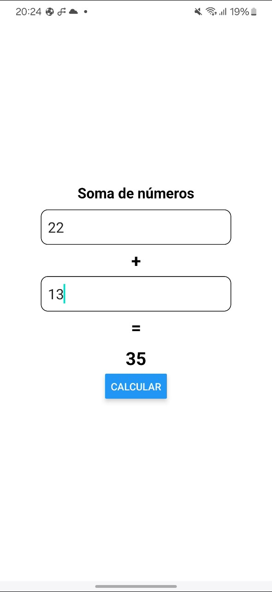

# Atividades

<figure><figcaption></figcaption></figure>

## Questões de estudo

1. Cite 3 componentes básicos do React Native e explique para o que servem.
2. Cite 2 hooks do React e explique para o que servem.
3. Desenvolva um aplicativo que tenha dois campos de texto que aceitem apenas números e faça uma função que some o resultado da soma dos dois números e mostre na tela.

<figure><figcaption></figcaption></figure>
